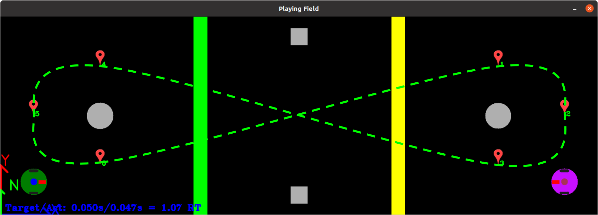

Creating GazelleSim Models
------
This section outlines the process for creating GazelleSim robot and environment models.  GazelleSim robot and environment models are fully defined using ROS parameters and an image file for the playing field.  Typically robots and the simulation environment are defined separately.  This allows the use of a given robot in multiple simulation environments.


GazelleSim Robots
-----
GazelleSim supports three type of robots: differential drive with a circular body, differential drive with a rectangular body and ackerman steer with a rectangular body.  Typically, the definition of a GazelleSim robot is contained in a single .yaml file.  To get started, we can use one of the robots supplied with GazelleSim: basic_differential_circ.yaml.  This file is located into the GazelleSim ROS package in the robot directory.

```
# Robot type: 'diff_drive_rect', 'diff_drive_circ' or 'acker_steer_rect'
robot_type: 'diff_drive_rect'

# Robot dimensions
robot_width:   0.280
robot_length:  0.320
rwheel:        0.050
wheel_width:   0.030
trackwidth:    0.220

# Forward facing camera location and size
camera_x: 0.070
camera_y: 0.000
camera_width:  0.020
camera_length: 0.050
camera_z: 0.5
camera_phi: deg(60)
camera_f: 700
camera_img_width: 640
camera_img_height: 480

# Lidar location and size
lidar_x: 0.02
lidar_y: 0.05
lidar_r: 0.030

# Set pen width (pixels)
pen_width: 2

# Set colors - RGB
robot_color:  [  0, 125,   0]
tire_color:   [ 30,  30,  30]
camera_color: [255,   0,   0]
lidar_color:  [  0,   0, 255]
```


GazelleSim Environment Models
-----
GazelleSim environment models are the environment that robots will navigate.  In contrast to GazelleSim robot models, GazelleSim environment models are typically defined in a ROS package.  Although creating a package for GazelleSim environment model is not completely necessary, following this practice makes using launching GazelleSim for various simulations very straight forward.

For this example, we will examine a GPS waypoint navigation problem that incorporates many of GazelleSim's capabilities.  The object is to develop two autonomous robots that traverse a figure-eight GPS waypoint course while ensuring that the two robots do not collide.  The final simulation environment is displayed below.


The goal is to have both robots travel a path defined by the GPS waypoints in ascending order and a looping method.  The desired path is shown below.



Another objective to ensure that the robots do not collide.  To minimize the chance of collision during the crossing paths, we introduce green and yellow lines to establish right of way rules.  Namely, if the two robots approach the path crossover point from opposite directions, the robot that pass the yellow line must yield to the robot that passed the green line.

Although academic, this example will leverage many of GazelleSim's features:
* GPS sensor to navigate the GPS waypoints
* Lidar sensor to detect objects to avoid collisions
* Camera sensor to detect right of way surface markings

Now, let's create this environment.

Defining the GazelleSim model package - gazelle_sim_waypoint_course
-----

We will create a GazelleSim model package in the packaged named gazelle_sim_waypoint_course.  The final structions is shown below.  

```
gazelle_sim_waypoint_course
├── CMakeLists.txt
├── doc
│   └── map_screenshot.png
├── launch
│   └── waypoint_course.launch
├── map
│   ├── waypoint_course.png
│   └── waypoint_course.yaml
├── package.xml
└── README.md
```

We can leverage ROS package creation tools to assist with creating GazelleSim model packages, but given the final content of the package it is typically easier to create the package manually.  Starting in the ROS workspace directory, we will create the package directory and enter the package directory:

```
mkdir gazelle_sim_waypoint_course
cd gazelle_sim_waypoint_course
```
Next, create the necessary sub-directories

```
mkdir doc
mkdir launch
mkdir map
```

Now, we create the CMakeLists.txt and package.xml files.  The contents of these files may be copied directly of the listings below.

CMakeLists.txt

```
cmake_minimum_required(VERSION 3.0.2)
project(gazelle_sim_waypoint_course)

find_package(catkin REQUIRED)

catkin_package( )
```

package.xml
```
<?xml version="1.0"?>
<package format="2">
  <name>gazelle_sim_waypoint_course</name>
  <version>0.0.1</version>
  <description>A GazelleSim sample waypoint course</description>

  <maintainer email="todo@todo.com">user name</maintainer>

  <license>MIT</license>

  <buildtool_depend>catkin</buildtool_depend>

</package>
```

### Defining the playing field
Our next step will be to define the playing field.  The playing field starts with an image that defines the GazelleSim ground plane.  In most cases, a .png or .jpg file are used to accomplish this task; however, the playing field image should not be selected arbitrarily.  The resolution of the playing file image dictates the model environment.  Most importantly, we need to consider now the image resolution will map physical coordinates.  For this example, we wish to define a playing field that represents a 9 meter by 3 meter area.  To accomplish this, we must ensure that (1) the image has the proper aspect ratio and (2) the image has significant resolution to support our camera sensor needs.  Please note that making the image unnecessarily large will slow down the GazelleSim solver.  For this example, we created a 1800 pixel x 600 pixel our playing field image.  Please note that this image may be created using many image authoring tools.


The image has the appropriate aspect ratio, but we need to ensure that it represents the desired physical dimensions of a 9 meter by 3 meter area.  To achieve this, we will specify the playing field resolution as 200 pixels/meter.  This will ensure the correct physical dimensions:  1800 pixels / (200 pixels/meter) = 9 meter.  600 pixels / (200 pixels/meter) = 6 meter.  

Once the image is created, place the image in the **map** directory in the package.


### Defining the simulation parameters

The next step in creating a GazelleSim package is to define the simulation parameters.  For this example, we will place the simulation parameters a file called waypoint_course.yaml that is loaded in the package **map** sub-directory.  The contents of this file are shown below:

```javascript showLineNumbers
# Field image
field_image_file: 'waypoint_course.png'

# Image file scaling and center
pixels_per_meter: 200.0
x_center_img: 0
y_center_img: 600
img_view_scale: 0.75


# GPS waypoints
gps_waypoints: [ [42.47478260461355,  -83.2491875719977],     # (1.5, 0.75)
                 [42.47479609440275,  -83.24911441423154],    # (7.5, 2.25)
                 [42.47478934948037,  -83.24910222128234],    # (8.5, 1.5)
                 [42.474782604578664, -83.24911441425125],    # (7.5, 0.75)
                 [42.47479609443764,  -83.24918757199376],    # (1.5, 2.25)
                 [42.474789349526894, -83.249199764958] ]     # (0.75, 1.5)
                 

# Circular obstructions
circlist: [ [ 7.5, 1.5, 0.2 ],
            [ 1.5, 1.5, 0.2 ] ]

# Rectangular obstructions
rectlist: [ [ 4.375, 0.425, 4.625, 0.425, 4.625, 0.175, 4.375, 0.175 ],
            [ 4.375, 2.825, 4.625, 2.825, 4.625, 2.575, 4.375, 2.575 ] ]
```

The above ymal file defines the parameters necessary to define our desired simulation environment.  The first five parameters are **required** parameters. 
* **field_image_file** defines the name of the playing field we placed in the map directory.
* **pixels_per_meter** defines the mapping of the playing field to physical coordinates, 200 pixels/meter.
* **x_center_img** is the x-coordinate (image pixel coordinate) of the location of the GazelleSim physical coordinate system (X=0, Y=0)
* **y_center_img** is the y-coordinate (image pixel coordinate) of the location of the GazelleSim physical coordinate system (X=0, Y=0)
* **img_view_scale** is the scaling of the playing field image as it is displayed on the screen during the simulation.  For this the displayed image is 75% of the original image.

Please note that GazelleSim uses the OpenCV image coordinate system: OpenCV images are zero-indexed, where the x-values go left-to-right (column number) and y-values go top-to-bottom (row number).  However, the physical coordinate system is X-values go left-to-right and Y-values go **bottom-to-top**.  This provide a physical coordinate system the produces a positive Z axis point out of the image using a right-handed coordinate system.

The next three parameters define the GPS waypoints, circular obstructions and rectangular obstructions.  In all cases, these parameters are defined in the two-dimensional lists as defined in the [Simulation Environment](../model_overview/sim-environment.md_) section.


### Defining the ROS launch file

The last step to complete before launching the newly define GazelleSim model is create a launch file.  For this example, we will create a file named waypoint_course.launch placed in the **launch** package sub-directory.

```
<launch>

  <!-- ==================== -->
  <!-- GazelleSim Arguments -->
  <!-- ==================== -->
  <arg name="show_dynamic_reconfigure" default="true" />
  <arg name="show_steering" default="false" />
  <arg name="show_cam_param" default="false" />
 
  <!-- ========================= -->
  <!-- Set simulation parameters -->
  <!-- ========================= -->
  <param name="map_dir" value="$(find gazelle_sim_waypoint_course)/map" />
  <rosparam command="load"
      file="$(find gazelle_sim_waypoint_course)/map/waypoint_course.yaml" />


  <!-- ============= -->
  <!-- Define robots -->
  <!-- ============= -->
  <rosparam>
    robot_list: ["robot1", "robot2"]
  </rosparam>

  <!-- Define robot1 -->
  <group ns="robot1">
    <rosparam command="load"
              file="$(find gazelle_sim)/robot/basic_differential_circ.yaml" />
    <rosparam>
        Xr_init: 0.5
        Yr_init: 0.5
        Theta_init: deg(0.0)
    </rosparam>
  </group>


  <!-- Define robot2 -->
  <group ns="robot2">
    <rosparam command="load"
              file="$(find gazelle_sim)/robot/basic_differential_circ.yaml" />
    <rosparam>
        Xr_init: 8.5
        Yr_init: 0.5
        Theta_init: deg(180.0)
        robot_color: [200, 15, 255]    
    </rosparam>
  </group>


  <!-- ================= -->
  <!-- Launch GazelleSim -->
  <!-- ================= -->
  <include file="$(find gazelle_sim)/launch/gazelle_sim.launch">
    <arg name="show_dynamic_reconfigure" value="$(arg show_dynamic_reconfigure)" />
    <arg name="show_steering" value="$(arg show_steering)" />
	<arg name="show_cam_param" value="$(arg show_cam_param)" />
  </include>

    
</launch>
```

The launch file is divided into multiple sections for clarity.  The first section defines the GazelleSim arguments.  GazelleSim support two arguments **show_dynamic_reconfigure**, **show_steering** and **show_cam_param**.  Since the ROS dynamic reconfigure GUI provides a main control mechanism for GazelleSim we typically want to keep the **show_dynamic_reconfigure** parameter true.  Setting the **show_steering** true will launch the rqt_robot_steering GUI when GazelleSim is launched.  Setting the **show_cam_param** true will launch the robot camera parameter dynamic reconfigure node.

The next section defines the simulation parameters.  Here we define the **map_dir** parameter (a required GazelleSim parameter).  Please note that it points to the **map** sub-directory in our package.  Next, we load the waypoint_course.yaml that we created earlier.  This two launch commands define the GazaelleSim simulation environment.

Next, we define the robots in our model.  This example has two robots, both based on the basic_differential_circ.yaml robot model provide with GazelleSim.  Please note that we first define the **robot_list** parameter and then define the robot parameters for each robot in the robot namespace.  These commands will create the the following GazelleSim parameters:

```
/robot1/camera_color
/robot1/camera_f
/robot1/camera_img_height
/robot1/camera_img_width
/robot1/camera_length
/robot1/camera_phi
/robot1/camera_width
/robot1/camera_x
/robot1/camera_y
/robot1/camera_z
/robot1/lidar_color
/robot1/lidar_r
/robot1/lidar_x
/robot1/lidar_y
/robot1/pen_width
/robot1/robot_color
/robot1/robot_radius
/robot1/robot_type
/robot1/rwheel
/robot1/tire_color
/robot1/trackwidth
/robot1/wheel_width
/robot2/Theta_init
/robot2/Xr_init
/robot2/Yr_init
/robot2/axle_dst

/robot2/camera_color
/robot2/camera_f
/robot2/camera_img_height
/robot2/camera_img_width
/robot2/camera_length
/robot2/camera_phi
/robot2/camera_width
/robot2/camera_x
/robot2/camera_y
/robot2/camera_z
/robot2/lidar_color
/robot2/lidar_r
/robot2/lidar_x
/robot2/lidar_y
/robot2/pen_width
/robot2/robot_color
/robot2/robot_radius
/robot2/robot_type
/robot2/rwheel
/robot2/tire_color
/robot2/trackwidth
/robot2/wheel_width
```

Lastly, we launch the GazelleSim simulation node with the **gazelle_sim.launch** file. 

### Completing the package 

The next step is compile the package so we may run a simualtion of this model.  To complete this step, we use catkin build the catkin workspace directory

```
<catkin workspace dir>$ catkin build
<catkin workspace dir>$ source devel/setup.bash
```

With a successful build, we can run our example

```
roslaunch gazelle_sim_waypoint_course waypoint_course.launch
```

Assuming all the files were created sucessufully followed by a successful launch, you should observe the following GazelleSim simulation environment.


### Final steps

It is customary add a README.md file and an image of the simulation for reference in the package.  The README.md file can be placed in the root directory of the package and should link to a screenshot of the simulation running.

Example README.md
```
# gazelle_sim_waypoint_course

A GazelleSim sample waypoint course


```

Where, map_screenshot.png is a screenshot of the running simulation placed in the **doc** sub-directory.


