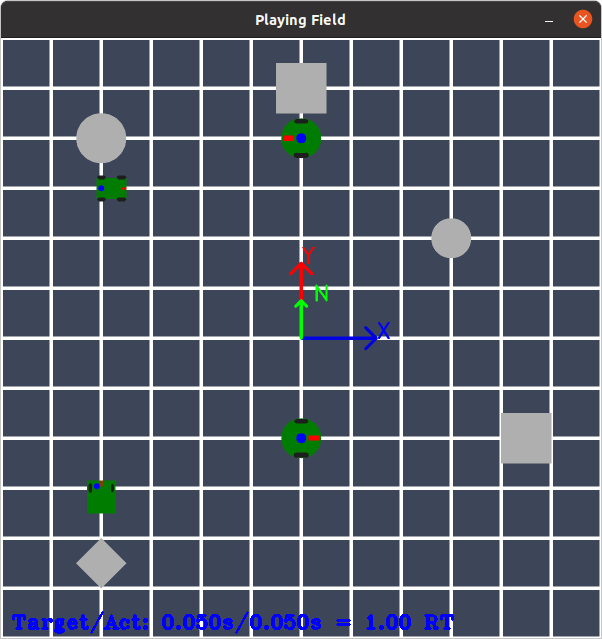
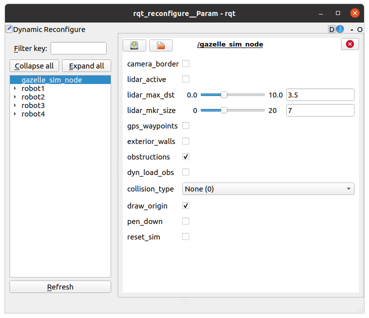
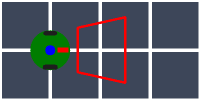
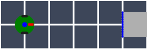
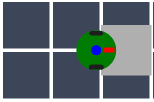
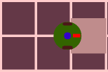
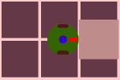
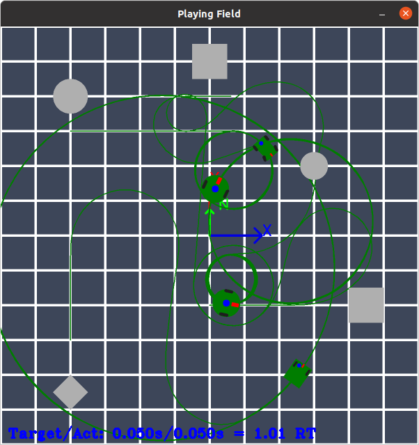
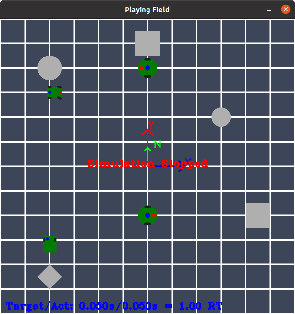

Getting Started
------

GazelleSim is installed with a few sample simulation environments and robots.  To get started, we can launch an example.

```
roslaunch gazelle_sim example_test_grid.launch
```

This loads an example playing field (test_grid.png) which represents a 6 meter by 6 meter square virtual environment.  In addition, four robots (robot1, robot2, robot3 and robot4) are generated as well as two rectangular and two circular obstructions.  For this example, the origin of the world two-dimensional coordinate system is located in the center of the image and the due-north is aligned with global y-axis.



By default, the GazelleSim simulator launches the ROS dynamic_reconfigure node.  This node provides the primary user control.  To begin, let's select the gazelle_sim_node in dynamic_reconfigure and review the user controls.



The dynamic reconfigure parameters are:
* **camera_border** [bool] - Flag to turn on the camera image border on the playing field.  false = OFF, true = ON.  When the camera_border is set to true, GazelleSim will draw the border of the camera image projected onto the playing field.  Please note that is for visualization purposes.  Therefore camera image borders will not be observed in other camera views.

| Camera OFF  | Camera ON   |
| ----------- | ----------- |
|  |  |


* **lidar_active** [bool] - Flag to activate lidar scan. false = OFF, true =  ON.  When the lidar active flag is set to true, GazelleSim will compute, display and publish lidar scans for all robot lidar.  All robots and obstructions are assumed to be visible by lidar scanning.  A lidar detection is show visually in GazelleSim with a lidar point marker.

| Lidar OFF   | Lidar ON   |
| ----------- | ----------- |
|  |  |


* **lidar_max_dist** [m] - Maximum lidar object sensing distance.  This parameter controls how from the robot lidar can sense objects.

* **lidar_mkr_size** [int] - Lidar marker size in pixels.  This parameter controls the size of the lidar scan detection markers displayed on the playing field objects.

* **gps_waypoints** [bool] - Flag to control the display of GPS waypoints.  false = OFF, true = ON.  Setting this parameter true will cause GazelleSim to display any defined GPS waypoints on the playing field.

* **exterior_walls** [bool] - Flag to activate exterior boundary walls. false = OFF, true = ON.  Setting this parameter true will create objects at the border of the playing image.  This can used to accurate monitor when a robot reaches the boundary of the playing field.

* **obstructions** [bool] - Flag to display obstructions.  false = OFF, true = ON.  This parameter allows users to display and remove the rectangle and circular obstructions dynamically.  Please note that this does effect the exterior walls of the playing field - that is handled separately with the exterior_walls parameter.

* **dyn_load_obs** [bool] - Flag to dynamically read obstruction parameters.  false = OFF, true = ON.  This parameter allows GazelleSim to read the obstruction parameters (rectlist and circlist) for each time step of the simulation and updated the simulation environment accordingly.  Setting this parameter true in conjunction with updating the ROS obstruction parameters provides a mechanism for moving the GazelleSim obstructions during a simulation.

* **collison_type** [int] - Flag to control collision model.  0 = No collision, 1 = Soft collision, 2 = Hard collision.  Gazzelle Sim offers three collision models.  The default model, No collision, ignores robot to robot and robot to obstruction collisions.  The second model, Soft collision, allows robots to collide with other robots and obstructions without effecting the robot motion.  With the soft model, a collision is demonstrated by coloring the playing field red; however, the robot motion will continue with no interruption.  The last model, Hard collision, will pause the simulation when a collision occurs (the playing field is colored red in this case as well).  Please note a single collisions pausing the entire simulation.  The table below displays examples of the collision model.


| No Collision | Soft Collision | Hard Collision |
| ------------ | -------------- | -------------- |
|  |  |  | |

* **draw_origin** [bool] - Flag to draw the original on the playing field.  false = OFF, true = ON.  This parameter controls if the origin is draw on the playing field.  Please note that the origin is considered part of the playing field and can be viewed by robot cameras.

* **pen_down** [down] - Flag to control when the robot path is drawn by a pen located at the robot center.  false = OFF, true = ON.  This parameter controls if the path of the center of the robot tracked with a path pen drawing.  When set to true, all robots' paths will drawn on the playing field.  When set to false, all robot's paths are erased from the playing field and path pen drawing is paused.

* **reset_sim** [bool] - Flag to reset the simulation to the start state.  false = Off, true = ON.  This parameter will allow user to "reset" the simulation the initial state of the simulation.  Please note that that simulation is stopped until the reset_sim flag is set to false.

| Reset Sim OFF | Reset Sim ON |
| ------------- | ------------ |
|  |  |


Next: [Simulation Environment](../model_overview/sim-environment.md)
