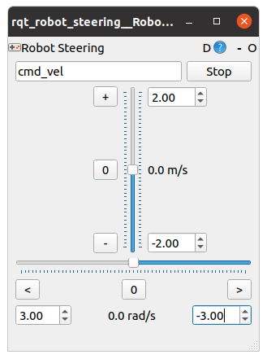
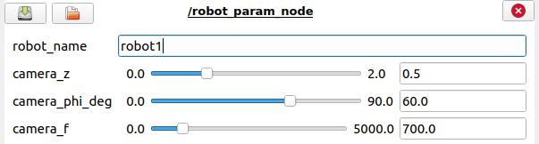

GazelleSim Launch File
------

The GazelleSim launch file provides a mechanism for running GazelleSim.  The contents of the GazelleSim launch file are shown below.

```
<launch>

  <!-- ################## -->
  <!--  Launch Arguments  -->
  <!-- ################## -->
  <!-- Open dynamic reconfigure window -->
  <arg name="show_dynamic_reconfigure" default="true" />

  <!-- Launch the robot steering gui -->
  <arg name="show_steering" default="false" />

  <!-- Launch the robot camera parameter gui -->
  <arg name="show_cam_param" default="false" />


  <!-- ################ -->
  <!--  Required Nodes -->
  <!-- ################ -->
  <!-- The directory of the GazelleSim package -->
  <param name="gazelle_sim_package_dir" value="$(find gazelle_sim)" />

  <node name="gazelle_sim_node" pkg="gazelle_sim"
        type="gazelle_sim_node" required="true" output="screen"/>  


  <!-- ################ -->
  <!--  Optional Nodes -->
  <!-- ################ -->
  <!-- Dynamic reconfigure -->
  <group if="$(arg show_dynamic_reconfigure)">
    <node pkg="rqt_reconfigure" type="rqt_reconfigure" name="rqt_console" args="-t"/>
  </group>


  <!-- Steering -->
  <group if="$(arg show_steering)" >
    <node name="rqt_robot_steering" pkg="rqt_robot_steering" type="rqt_robot_steering">
      <param name="default_topic" value="cmd_vel" />
    </node>
  </group>


  <!-- Camera Parameter Node -->
  <group if="$(arg show_cam_param)" >
    <node name="robot_param_node" pkg="gazelle_sim"
    type="robot_param_adjust.py" output="screen">
    </node>
  </group>

</launch>
```

Please note that the playing field required parameters must be defined to successfully execute the GazelleSim launch file (see [Simulation Environment](../model_overview/sim-environment.md)


GazelleSim Launch File Arguments
------

The GazelleSim launch file provides three optional arguments:

* show_dynamic_reconfigure [default = true]: GazelleSim uses the dynamic reconfigure GUI to control multiple execution parameters.  In most cases, this parameter should be set true, its default value.

* show_steering [default = false]: This parameter can be used to launch the rqt_robot_steering GUI.  This GUI may be used to drive the robot by sending ROS Twist messages to the GazelleSim simulator.  This GUI is shown below.



* show_cam_param [default = false]: This parameter is used to automate the execution of the dynamic robot parameter adjustment node to dynamically modify a robot's camera parameters (height, angle and focal length).  Please note that the values in the dynamic reconfigure GUI are updated with the current GazelleSim camera parameter values for a given robot when the robot name is entered into the "robot_name" field.  An example of the robot parameter adjustment node interface is shown below.




Next: [ROS Network](../model_overview/ros-network.md)
