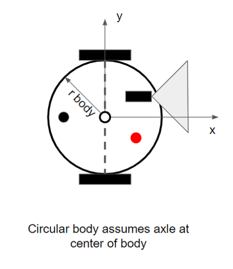
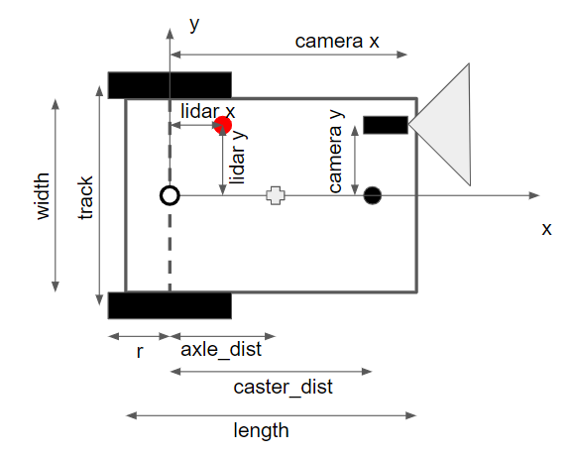
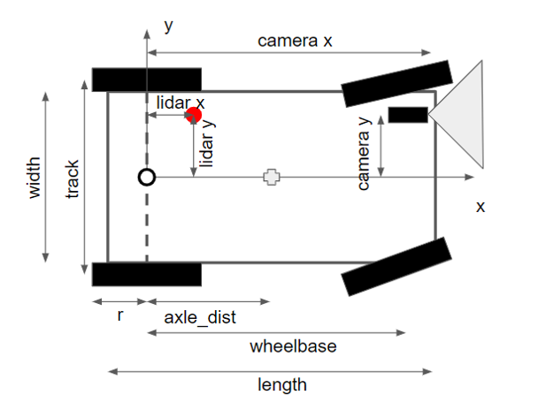

Robot Models
------
GazelleSim supports three robot types: differential drive with a circular body, differential drive with a rectangular body and ackerman steer with a rectangular body.  The The images below detail the types of robots that are supported.

Different Drive with Circular Body

Different Drive with Rectangular Body

Ackerman Steer with Rectangular Body

Required Robot Parameters
------
* robot_type [string] { 'diff_drive_circ', 'diff_drive_rect' or 'acker_steer_rect' }

For diff_drive_circ robots, the required parameters are
* robot_radius [double]
* rwheel [double]
* wheel_width [double]
* trackwidth [double]

For diff_drive_rect robots, the required parameters are
* robot_width [double]
* robot_length [double]
* rwheel [double]
* wheel_width [double]
* trackwidth [double]
* axle_dst [double]

For acker_steer_rect robots, the required parameters are
* robot_width [double]
* robot_length [double]
* rwheel [double]
* wheel_width [double]
* trackwidth [double]
* axle_dst [double] - set this parameter less than zero to create a trailing caster robot
* wheelbase [double]
* max_steer [double]

Please note that caster dimensions are no longer used in GazelleSim.

Optional Robot Sensing Parameters
------
Camera sensor (assumed forward facing and aligned with robot x-axis)
* camera_x [double] - x location of the camera lens
* camera_y [double] - y location of the camera lens
* camera_z [double] - height of the camera lens
* camera_phi [double] - Rotation of the camera around robot local y-axis. 0 deg is aligned with the global X-Y plane pointed straight forward; 90 deg aligned with the global Y-Z plane pointed straight down.
* camera_width [double] - width of the camera body
* camera_length [double] - length of the camera body
* camera_f [double] - camera image scale, similar to focal length
* camera_img_width [int] - width of the published camera image (in pixels)
* camera_img_height  [int] - height of the published camera image (in pixels)

Lidar sensor
* lidar_x [double] - x location of the lidar
* lidar_y [double] - y location of the lidar
* lidar_r [double] - radius of the lidar

Optional Robot Appearance Parameters
------
* robot_color [int, int, int] - RBG color of robot body
* tire_color [int, int, int] - RBG color of robot tires
* camera_color [int, int, int] - RBG color of camera sensor and camera bounding box
* lidar_color [int, int, int] - RBG color of lidar sensor and lidar detection points
* pen_width [int] - width of the pen path (in pixels)

Next: [Launch File](../model_overview/launch-file.md)
